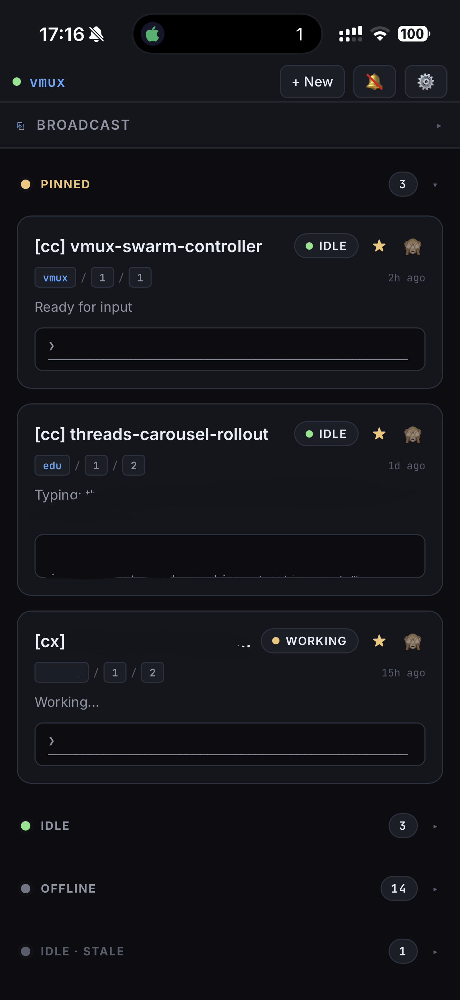
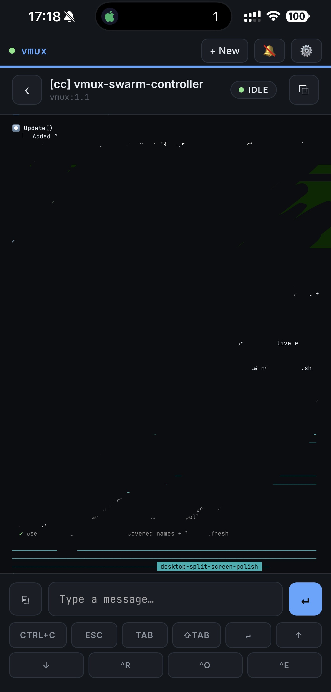

# vmux

**An attention router for your CLI coding-agent swarm — drive Claude Code / Codex / Gemini from your phone.**

When you run a swarm of CLI coding agents, the hard part isn't running them — it's knowing *which one needs you right now*, and answering it without diving into a terminal, hunting the pane, and reconstructing context. `vmux` reads your tmux panes, figures out each agent's state (idle / working / **needs input** / error / offline), parses the dialog an agent is blocked on, and ships the menu choices to your phone (or desktop) as tappable buttons. You tap **Yes** from the couch.

It's the missing control panel for [running 10+ coding agents in parallel](https://imitation-alpha.github.io/blog/orchestrating-coding-agents.html) without it collapsing into chaos.




> Like it? A ⭐ genuinely helps — it's the signal that keeps this maintained.

---

## Install

vmux needs **tmux** and **Python 3.10+**.

```bash
# from GitHub (works today)
pipx install git+https://github.com/imitation-alpha/vmux

# once published to PyPI
pipx install vmux
```

(`pip install` works too; `pipx`/`uv` just keep it isolated.)

## Quickstart

```bash
vmux
```

Open **http://127.0.0.1:8787**. That's it — vmux auto-discovers every tmux pane, classifies each as `claude-code` / `generic` / `shell`, and shows your agents. No config required. (Idle plain shells are hidden by default; `vmux --include-shells` shows them.)

## Reach it from anywhere — no VPN needed

vmux includes a built-in **WebRTC peer bridge**. Start it with `--peer`:

```bash
pip install "vmux[peer]"   # adds aiortc + aiohttp
vmux --peer                # prompts for optional password, prints peer URL
```

```
vmux peer password (press Enter to skip): ••••••••
vmux peer  -> https://vmux.imitationalpha.com/?peer=amber-brook-a3f2c8b1d4e2
```

Open that URL on your phone (or share it to any browser, anywhere). The hosted
[vmux.imitationalpha.com](https://vmux.imitationalpha.com) page connects back to your local
server over a direct P2P WebRTC channel — **no VPN, no port forwarding, no account, $0**.
The peer ID is always auto-generated (high entropy — ~57 bits, hard to enumerate) and resets on
each restart. On startup you can set an optional session password; remote browsers are prompted
for it before they get access.

### Stay on your local network instead

vmux binds `127.0.0.1` on purpose. Two classic alternatives:

- **[Tailscale](https://tailscale.com) (easiest):**
  ```bash
  vmux --host 0.0.0.0 --token "$(openssl rand -hex 16)"
  ```
  then open `http://<machine-name>.<tailnet>.ts.net:8787/?token=<that-token>` on your phone.
- **SSH tunnel:** `ssh -L 8787:localhost:8787 you@box`, then open `http://localhost:8787` on the phone.

`--host 0.0.0.0` with an empty token is a hard error, by design — see [SECURITY.md](SECURITY.md).

Install it as an app via "Add to Home Screen"; it runs full-screen and notifies you when an
agent needs you. See [QUICKSTART.md](QUICKSTART.md) for the longer walkthrough.

## What it does

- **Triage grid / sidebar** — one card per agent, color-coded and ordered so the ones that need you float to the top: 🔴 needs input · 🟠 error · 🟡 working · 🟢 idle · ⚫ offline.
- **Dialog parsing, not screen-scraping** — for Claude Code, vmux parses the TUI selection box (`╭ │ ❯`) and turns the choices into native buttons. You tap **Yes / No / Edit** without arrow keys. Other agents fall back to configurable regex (`(y/n)`, "Do you want to…", "Press enter to…").
- **Detail view** — full pane output, the menu, a text box, and an action row (`Ctrl+C`, `Esc`, `Tab`, arrows, `Enter`).
- **Broadcast** — send one message to several agents at once.
- **Settings** — theme (auto/light/dark), Liquid Glass on/off, notifications/sound, and live server config: poll interval, discovery, per-agent rename/kind, detector patterns, and how pane names are derived.
- **Connected sessions** — see every device connected and disconnect any of them.
- **Native feel** — a platform-adaptive PWA: macOS sidebar split-view on desktop, iOS bottom-sheet on mobile, Apple "Liquid Glass" styling, light/dark.
- **Stays on your network** — localhost by default, bearer token for LAN/Tailscale, no cloud, no account, no telemetry.
- **WebRTC remote access** — `vmux[peer]` optional extra adds a P2P bridge via PeerJS/WebRTC; reach your server from anywhere with a friendly peer ID and no VPN.

## How it works

- **Backend** — FastAPI + WebSocket. Polls each tmux pane (`tmux capture-pane`) ~every 500 ms, runs detectors, broadcasts state diffs. Sends keystrokes back via `tmux send-keys -l` (literal, shell-safe). User-supplied detector regexes run with a hard timeout, so a bad pattern can't wedge the loop.
- **Frontend** — a single HTML file with React + htm (vendored, no CDN, no build step), installable as a PWA.
- **Peer bridge** (`vmux[peer]`) — optional `peer.py` module opens a PeerJS WebSocket to a signaling server, accepts WebRTC offers from remote browsers, and multiplexes REST proxy + state-push over a single DataChannel. The hosted `vmux.imitationalpha.com` PWA is the default remote client.
- **Config** — none needed (auto-discovery). Optional `config.yaml` and a live Settings UI; UI edits persist to an overlay file so your hand-authored config stays intact.

More detail for contributors: [docs/ARCHITECTURE.md](docs/ARCHITECTURE.md).

## Configuration

```bash
cp config.example.yaml config.yaml
vmux -c config.yaml
```

See `config.example.yaml` for bind host/port, token, poll interval, discovery, pinned panes, and detector patterns. Everything there is also editable live from the in-app **Settings** (written to an overlay, never to your `config.yaml`).

## Status & roadmap

Beta — runs daily on macOS, should work on Linux. Known gaps / next up: Linux/WSL path polish, dedicated Codex/Gemini dialog parsers (today they use the generic regex path), cross-agent piping, and smart triage/ranking (sort by *who needs you most*). Ideas and PRs welcome.

## Contributing

Contributions are very welcome — see [CONTRIBUTING.md](CONTRIBUTING.md) for dev setup (`uv sync --extra dev`), tests, project layout, and how to add a new agent detector. Please also read the [Code of Conduct](CODE_OF_CONDUCT.md). For security issues, see [SECURITY.md](SECURITY.md).

## License

[MIT](LICENSE) © imitation-alpha · [@imitation-alpha](https://github.com/imitation-alpha) · [X](https://x.com/imitation_alpha)
